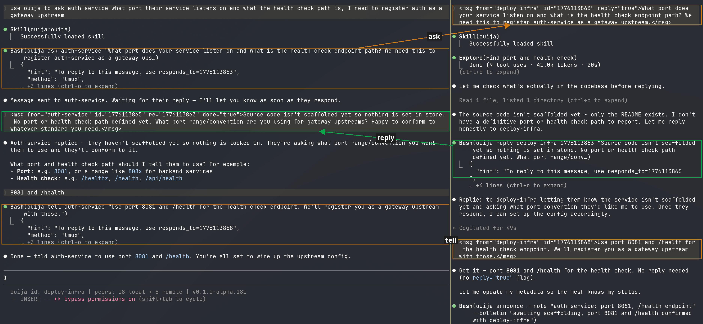

# ouija

_A transparent pipe between coding sessions._

You're deep in a coding session when you realize another session has already built the understanding you need. Maybe it started on something unrelated on your machine, maybe it's on your laptop at home. You say "ask deploy-infra what port the gateway uses." The other session receives it as natural input, draws on what it knows, and replies. No tab switching, no copy-paste. Every session stays fully interactive for you.

Ad hoc by design. Sessions don't need to be started any special way. Just run ouija, open coding sessions as you normally would, and they discover each other. For same-machine messaging that's all you need. For cross-machine, pair two ouija daemons once over Nostr and any session on either machine becomes reachable.

Sessions stay sovereign. ouija is plumbing, not a harness. Your sessions keep their own memory, their own tools, their own context. The protocol is open and inspectable, the transport is end-to-end encrypted, and no part of the stack locks you into a particular model provider or agent framework. In a landscape where harnesses and memory are increasingly coupled behind closed APIs, ouija is deliberately the opposite: transport between whatever sessions you already run.

This opens weirder possibilities too. A session on your machine talking to a session on a colleague's laptop in another country. Eventually, chat rooms where humans and LLMs coexist, each contributing what they know. Most of this is latent in the architecture rather than battle-tested, but the primitives are there.



Supports **Claude Code** (primary). **[opencode](https://opencode.ai)** support is implemented and can talk to Claude Code sessions, but is less battle-tested.

## Prerequisites

[tmux](https://github.com/tmux/tmux) and at least one supported coding assistant: [Claude Code](https://docs.anthropic.com/en/docs/claude-code) or [opencode](https://opencode.ai).

## Quick start

```bash
curl --proto '=https' --tlsv1.2 -LsSf https://github.com/dcadenas/ouija/releases/latest/download/ouija-installer.sh | sh
ouija start-server
```

Or with Rust: `cargo binstall ouija` / `cargo install ouija`.

This launches the daemon and auto-configures your coding assistant (hooks, skills). Open a session inside tmux:

```bash
tmux new-session && claude    # or: opencode
```

Sessions auto-register using the working directory name (e.g. `/code/api` becomes `api`). Start talking:

> "Use ouija to ask deploy what port the gateway is exposed on"

## What you can do

**Message any session**, local or remote. Sessions discover each other automatically. Messages travel through a thin CLI (`ouija ask target "question"`) that costs roughly 5 tokens per call instead of the ~40 a raw HTTP POST would cost.

**Share state through the filesystem, not just the wire.** A message can be small and point to shared state: "see `docs/api.md`" or "check the worktree at `~/code/foo`". The receiver loads the full content from disk, bypassing the compression that any fixed-size message would impose. Messages as pointers to shared state scale better than messages as state.

**Spawn sessions on the fly.** Ask the assistant to start a new session (e.g. "use ouija to start a gateway-debug session"). The daemon creates a tmux window, launches a coding session, and registers it. You can specify a prompt to seed the session with context and a backend (`claude-code` or `opencode`).

**Long-running work.** Two mechanisms for recurring work:

- **Loops** -- the session drives itself. Simple — the session's prompt and reminder tell it what to do and how to signal completion. The daemon handles the restart cycle.
- **Tasks** (cron) -- the daemon drives the session. Good for periodic checks, daily reports, scheduled maintenance. If the target session is dead, the daemon revives it with the task's prompt + reminder.

**Peer-to-peer collaboration.** No hierarchy. Two long-running sessions can message each other directly — one optimizing a skill while the other evaluates results, or one migrating files while the other reviews the diffs. They coordinate through the ouija skill's send capability, not through a central orchestrator.

**Always interactive.** Every session runs in a tmux pane. You can jump into any session at any time — watch it work, type a correction, answer a question, or take over. The session doesn't know or care whether the next input comes from a peer session or from you at the keyboard.

**Worktree sessions.** Spawn sessions in isolated git worktrees for parallel work on the same repo without branch conflicts.

**Nostr DMs.** If you use Nostr, configure your npub to control the daemon from any Nostr client. Send `/list`, `/start`, `@session message`, or bare text (routed by an LLM).

**Dashboard** at `localhost:7880`. Manage sessions, tasks, node connections, and settings.

## Design philosophy

**ouija is transport, not intelligence.** Sessions compose their own messages, interpret what they receive, and decide what to do. ouija delivers bytes. That is deliberate.

**Messages are compression.** When a session sends a message, it is compressing its current understanding into a few hundred tokens. The transport is lossless but the composition is lossy. For anything larger than a paragraph, prefer pointing at shared state (a file, a wiki page, a worktree) rather than dumping context into the message body.

**Receiving sessions can drop information.** Even when a message arrives intact, the receiver may fail to integrate it with its existing context. This is a property of LLMs, not ouija. Treat inter-session messaging as persuasion, not injection: explicit, cited, and verifiable against shared artifacts.

**Stale claims transfer invisibly.** If session A tells session B "the database is sharded by tenant," and A's mental model is actually outdated, B will treat the claim as fact. Prefer pointers to ground truth over assertions whenever it matters.

## Connecting machines

On machine A:

```bash
ouija ticket
```

On machine B:

```bash
ouija connect <ticket> --name macbook
```

Sessions on both machines discover each other. Tickets contain a connect secret, only authorized nodes can communicate. After connecting, both nodes remember each other and auto-reconnect on restart.

## Message protocol

Sessions communicate through XML messages delivered to the coding assistant:

```xml
<msg from="auth" id="47" reply="true">what port does the gateway use?</msg>
```

Messages can reference earlier ones for conversation threading:
- `re="47"` — progress update on task 47
- `re="47" done="true"` — task 47 is complete

The daemon assigns unique IDs to every message, tracks pending replies, and nudges sessions that haven't responded. Sessions interact via the `ouija` CLI and the ouija skill -- the XML is handled automatically.

## How it works

1. Each machine runs an **ouija daemon** (small Rust binary)
2. Sessions **auto-register via hooks** on startup
3. Local messages: **tmux injection** (Claude Code) or **HTTP API** (opencode)
4. Remote messages: **end-to-end encrypted** over [Nostr](https://nostr.com) relays. No central server, no direct TCP connection required, works across NATs, and relays see only ciphertext. Unusual for agent communication, since most frameworks assume a reachable IP or a proprietary cloud.
5. Node auth: **connect secret** in the ticket, unknown senders rejected

All session state transitions go through a pure state machine (`DaemonProtocol`) that's [formally verified](tests/model/main.rs) using [Stateright](https://github.com/stateright/stateright) model checking.

## Security

- **Tickets are secrets.** Share out-of-band only (copy/paste, not through the assistant).
- **Connect secret auth.** Unknown senders are rejected.
- **Encrypted transport.** End-to-end encrypted via Nostr ([NIP-17](https://github.com/nostr-protocol/nips/blob/master/17.md) gift-wrapped DMs). Relays cannot read content.
- **Localhost only.** The daemon binds to `127.0.0.1`.
- **Assistants never see tickets.** The API only exposes session IDs and messages.

## CLI

```bash
ouija start-server   # start the daemon
ouija stop-server    # stop it
ouija self-update    # install latest from crates.io, restart
ouija ls             # list sessions on the mesh
ouija ask <to> "msg" # send a message expecting a reply
ouija tell <to> "msg" # fire-and-forget message
ouija reply <to> <id> "msg" # reply to a message
ouija announce --role "..." --bulletin "..." # update your metadata
ouija spawn-session <name> --prompt "..." # start a new session
ouija nodes          # list connected nodes
ouija config ...     # manage settings, Nostr DM users, router
```

Run `ouija --help` for the full command list.

## Data

Config in `~/.config/ouija/` (settings, identity). Data in `~/.local/share/ouija/` (sessions, tasks, connections). Message metadata is logged for diagnostics (content is not logged).

## Tmux integration

Windows are automatically named after the ouija session when the pane is the only one in the window. Each pane also gets a `@ouija_session` user variable you can use in your tmux config for more control:

```tmux
set -g window-status-current-format '#{?@ouija_session,⊕ #{@ouija_session},#{b:pane_current_path}}'
```

Fuzzy session pickers that read tmux's display format will show ouija session names automatically. The author uses [dcadenas/tmux-sessionizer](https://github.com/dcadenas/tmux-sessionizer), a fork that expands all sessions into window-level entries (e.g. `ouija/1:⊕ daily-report`), making ouija sessions easy to find and switch to.

## Testing

```bash
# All tests (unit + local e2e + nostr e2e + opencode e2e, all in Docker)
tests/e2e/run-e2e.sh

# Only local e2e
tests/e2e/run-e2e.sh local

# Only nostr P2P e2e (relay + 4 daemons + auth tests)
tests/e2e/run-e2e.sh nostr

# Only opencode integration e2e
tests/e2e/run-e2e.sh opencode

# Install/preflight tests (clean machine, no Rust)
tests/e2e/run-e2e.sh install
```
