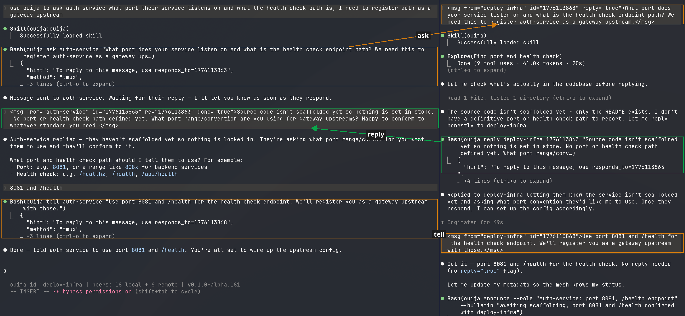
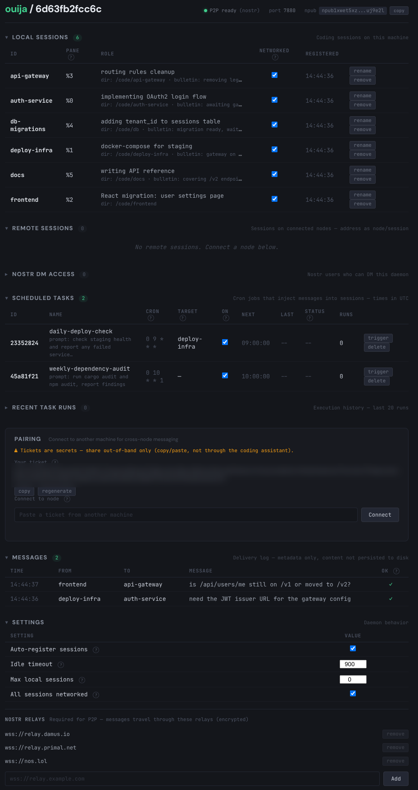

# ouija

_A transparent pipe between coding sessions through tmux._

You're deep in a coding session when you realize another session has the understanding you need. Maybe it started on something unrelated on your machine, maybe it's on your laptop at home. You say "ask deploy-infra what port the gateway uses." The other session receives it as natural input, draws on what it knows, and replies. Every session stays fully interactive for you.



Ad hoc by design. Sessions don't need to be started any special way. Run ouija, open coding sessions as you normally would, and they discover each other. For same-machine messaging that's all you need. For cross-machine, pair two ouija daemons once over Nostr and any session on either machine becomes reachable.

ouija is plumbing, not a harness. It delivers messages between sessions and manages their lifecycle. The protocol is open, the transport is end-to-end encrypted, and sessions keep their own memory, tools, and context. Today ouija supports Claude Code (primary, well-tested), opencode (integrated, less battle-tested), and the [Codex CLI](https://developers.openai.com/codex) (TUI-injection backend — see [docs/codex-cli.md](docs/codex-cli.md)). Additional backends would plug in through the same hook and API surface the existing ones use.

The session lifecycle primitives (spawn, kill, health checks, worktree isolation) may also be useful beneath a higher-level harness or orchestrator, but ouija itself stays small: discover sessions, deliver messages, and keep sessions reachable.

## Prerequisites

[tmux](https://github.com/tmux/tmux) and at least one supported coding assistant: [Claude Code](https://docs.anthropic.com/en/docs/claude-code), [opencode](https://opencode.ai), or the [Codex CLI](https://developers.openai.com/codex).

## Quick start

```bash
cargo install ouija
ouija start-server
```

If a matching prebuilt release artifact is available for your platform, `cargo binstall ouija` can install it without compiling.

`ouija start-server` runs the daemon in the foreground. Keep it running in that terminal, or run it under your service manager.

The daemon auto-configures your coding assistant (hooks, skills). In another terminal, open a session inside tmux:

```bash
tmux new-session && claude    # or: opencode, codex
```

Sessions auto-register using the working directory name (e.g. `/code/api` becomes `api`). Start talking:

> "Use ouija to ask deploy what port the gateway is exposed on"

## What you can do

**Message any session**, local or remote. Sessions discover each other automatically. Messages travel through a short CLI command (`ouija ask target --message-file question.txt`) instead of making the assistant compose raw HTTP requests.

**Share state through the filesystem, not just the wire.** A message can be small and point to shared state: "see `docs/api.md`" or "check the worktree at `~/code/foo`". The receiver loads the full content from disk, bypassing the compression that any fixed-size message would impose. Messages as pointers to shared state scale better than messages as state.

**Spawn sessions on the fly.** Ask the assistant to start a new session (e.g. "use ouija to start a gateway-debug session"). The daemon creates a tmux window, launches a coding session, and registers it. You can specify a prompt to seed the session with context and a backend (`claude-code`, `opencode`, or `codex-cli`).

**Long-running work.** Two mechanisms for recurring work:

- **Loops** -- the session drives itself. Simple — the session's prompt and reminder tell it what to do and how to signal completion. The daemon handles the restart cycle.
- **Tasks** (cron) -- the daemon drives the session. Good for periodic checks, daily reports, scheduled maintenance. If the target session is dead, the daemon revives it with the task's prompt + reminder.
- **Inject-only tasks** -- a cron message targets one exact currently live Local session and fails closed otherwise. This mode never creates, revives, restarts, or respawns a session.

**Peer-to-peer collaboration.** No hierarchy. Two long-running sessions can message each other directly — one optimizing a skill while the other evaluates results, or one migrating files while the other reviews the diffs. They coordinate through the ouija skill's send capability, not through a central orchestrator.

**Always interactive.** Every session runs in a tmux pane. You can jump into any session at any time — watch it work, type a correction, answer a question, or take over. The session doesn't know or care whether the next input comes from a peer session or from you at the keyboard.

**Worktree sessions.** Spawn sessions in isolated git worktrees for parallel work on the same repo without branch conflicts. Restarts preserve the worktree. `kill-session` also preserves it by default; `--delete-worktree` explicitly requests destructive cleanup, which refuses to delete a worktree containing dirty, untracked, or ignored artifacts.

**Nostr DMs.** If you use Nostr, configure your npub to control the daemon from any Nostr client. Send `/list`, `/start`, `@session message`, or bare text (routed by an LLM).

**Dashboard** at `http://localhost:7880`. Manage sessions, tasks, node connections, and settings.

<a href="admin-screenshot.png"></a>

## Design philosophy

**ouija is transport, not intelligence.** Sessions compose their own messages, interpret what they receive, and decide what to do. ouija delivers bytes. That is deliberate.

**Messages are compression.** When a session sends a message, it is compressing its current understanding into a few hundred tokens. The transport is lossless but the composition is lossy. For anything larger than a paragraph, prefer pointing at shared state (a file, a wiki page, a worktree) rather than dumping context into the message body.

**Receiving sessions can drop information.** Even when a message arrives intact, the receiver may fail to integrate it with its existing context. This is a property of LLMs, not ouija. Treat inter-session messaging as persuasion, not injection: explicit, cited, and verifiable against shared artifacts.

**Stale claims transfer invisibly.** If session A tells session B "the database is sharded by tenant," and A's mental model is actually outdated, B will treat the claim as fact. Prefer pointers to ground truth over assertions whenever it matters.

### Active-context refresh

Call the first setup **bootstrap active-context refresh** and later
safe-boundary restarts **refresh context**. A successful fresh restart resets
the active-time counter automatically; there is no separate rearm command.

For a new manually managed session, bootstrap the policy with `spawn-session`
(there is no `ouija spawn` alias). `spawn-session` has no `--one-shot-file`, so
its stored `--prompt-file` must be the complete bounded assignment:

```bash
ouija spawn-session worker --project-dir /path/to/project \
  --parent-session hub --when-done ask-parent \
  --fresh-context-after-active 4h --prompt-file /path/to/base-prompt.txt
```

For an existing session, inspect its exact Local row in `ouija status` before
the fresh restart. Keep a concise durable base prompt in stored `prompt`; if it
is null or transient handoff/recovery prose, replace it with `--prompt-file`. Put
only verified mutable work in the launch-only continuation:

```bash
ouija restart-session worker --fresh --fresh-context-after-active 4h \
  --prompt-file /path/to/base-prompt.txt \
  --backend codex-cli \
  --one-shot-file /tmp/verified-continuation.txt
```

Omit `--prompt-file` when the stored prompt is already durable. Specify `--backend`
when the current binding is absent or cannot be trusted; use only the exact
current backend. If `ouija whoami` safely refuses stale evidence, recover only
with the exact public Local ID supplied by trusted injected context or the
operator, verify that exact status row, and never infer identity from a
project/name match or `ouija ls`.

The duration is a positive whole number of `h`, `m`, or `s`, such as `4h`,
`90m`, or `3600s`. Active time pauses while the session is parked. Once due,
Ouija gives its mandatory notice only at a safe stopped boundary, then repeats
it at every later stopped boundary until a fresh restart succeeds. To refresh
context, verify live state, write a small continuation, and run the exact
restart command in that notice. The durable stored prompt is replayed before
the one-shot continuation.

This workflow creates no scheduler tasks, does not traverse or discover child
sessions, and does not discover native subagents. Another session is in scope
only when it is Local and its `parent_session` exactly equals the current
session's exact public Local ID, or when the operator explicitly allowlists its
ID. Lifecycle-only setup does not justify broad repository tests, ignored
Stateright, or expensive e2e. `ouija rollover` remains a separate legacy/manual
facility for an operator-chosen prepared-record handoff; it is not the
active-context refresh workflow. See the installed Ouija skill for the
canonical bootstrap, verification, and safe-boundary procedures.

## Connecting machines

On machine A:

```bash
ouija ticket
```

On machine B:

```bash
ouija connect <ticket> --name macbook
```

Sessions on both machines discover each other. Tickets contain a connect secret, only authorized nodes can communicate. After connecting, both nodes remember each other and auto-reconnect on restart.

## Message protocol

Sessions communicate through XML messages delivered to the coding assistant:

```xml
<msg from="auth" id="47" reply="true">what port does the gateway use?</msg>
```

Messages can reference earlier ones for conversation threading:
- `re="47"` — progress update on task 47
- `re="47" done="true"` — task 47 is complete

The daemon assigns unique IDs to every message, tracks pending replies, and nudges sessions that haven't responded. Sessions interact via the `ouija` CLI and the ouija skill -- the XML is handled automatically.

## How it works

1. Each machine runs an **ouija daemon** (small Rust binary)
2. Sessions **auto-register via hooks** on startup
3. Local messages: **tmux injection** (Claude Code) or **HTTP API** (opencode)
4. Remote messages: **end-to-end encrypted** over [Nostr](https://nostr.com) relays. No central server, no direct TCP connection required, works across NATs, and relays see only ciphertext. Unusual for agent communication, since most frameworks assume a reachable IP or a proprietary cloud.
5. Node auth: **connect secret** in the ticket, unknown senders rejected

All session state transitions go through a pure state machine (`DaemonProtocol`) with a [Stateright](https://github.com/stateright/stateright) model check in [`daemon_protocol.rs`](src/daemon_protocol.rs).

## Security

- **Tickets are secrets.** Share out-of-band only (copy/paste, not through the assistant).
- **Connect secret auth.** Unknown senders are rejected.
- **Encrypted transport.** End-to-end encrypted via Nostr ([NIP-17](https://github.com/nostr-protocol/nips/blob/master/17.md) gift-wrapped DMs). Relays cannot read content.
- **Localhost only.** The daemon binds to `127.0.0.1`.
- **Keep tickets out of chats.** Normal session APIs do not expose tickets, but any assistant with shell access can run CLI commands you ask it to run.
- **Persistent logs are metadata-only.** `messages.jsonl` records routing metadata; the dashboard may show recent in-memory message content until restart.

### Claude Code permissions

Ouija does not force Claude Code into bypass-permissions mode by default. Spawned Claude sessions inherit your Claude Code settings, such as `permissions.defaultMode` in `~/.claude/settings.json`.

If you run ouija inside an isolated environment and want spawned Claude sessions to skip permission prompts, opt in explicitly:

```bash
ouija config set claude_permission_mode bypassPermissions
```

To return to Claude Code's own default behavior:

```bash
ouija config set claude_permission_mode default
```

### Codex model routes

Ouija-launched Codex sessions normally use Codex's own default home resolution
(`$CODEX_HOME` or `~/.codex`). You can add a Codex-specific route so a
user-facing model alias selects a provider-specific Codex home without exposing
that detail on every session:

```bash
ouija config set-codex-model-route gemini \
  --model gemini-2.5-pro \
  --codex-home ~/.cache/codex-gemini

ouija spawn-session worker --backend codex-cli --model gemini \
  --no-parent-session --when-done keep-open
```

The alternate Codex home owns its own `config.toml` and provider setup. For
Gemini, run a local Responses-compatible sidecar such as LiteLLM on localhost
and point that Codex home at the proxy; the Gemini API key stays in the sidecar
environment. Sessions without `--model gemini` continue using the normal Codex
default, for example `gpt-5.5` with whatever reasoning effort is configured in
`~/.codex/config.toml`. Passing Ouija `--effort low` to a Codex session overrides
that for the launched session with `-c 'model_reasoning_effort="low"'`.

## CLI

```bash
ouija start-server   # run the daemon process
ouija stop-server    # stop it
ouija self-update    # install latest from crates.io, restart
ouija ls             # list sessions on the mesh
ouija status         # full daemon and session JSON, including active-context status
ouija whoami         # print this session's own id (fails loudly if unresolvable)
ouija ask <to> --message-file question.txt # send a message expecting a reply
ouija tell <to> --message-file note.txt # fire-and-forget message
ouija reply <to> <id> --message-file reply.txt # reply to a message
ouija rename <new-id> --from <current-id> # rename an exact Local session
ouija announce --role "..." --bulletin "..." # update your metadata
ouija spawn-session <name> --no-parent-session --when-done keep-open --prompt-file base-prompt.txt # start a new session
ouija spawn-session <name> --no-parent-session --when-done keep-open --fresh-context-after-active 4h --prompt-file base-prompt.txt # opt in to active-context refresh
ouija restart-session <name> --fresh --prompt-file base-prompt.txt --backend codex-cli # replace stored prompt and restart
ouija restart-session <name> --fresh --fresh-context-after-active 4h --one-shot-file continuation.txt # set/change the active limit
ouija kill-session <name> # stop the session and preserve its worktree
ouija kill-session <name> --delete-worktree # explicitly request destructive worktree cleanup
ouija nodes          # list connected nodes
ouija config ...     # manage settings, Nostr DM users, router
```

`ask`, `tell`, and `reply` accept message bodies only through `--message-file`.
For inline text, use `--message-file /dev/stdin` with a quoted heredoc delimiter.
This prevents shell expansion of backticks, `$()`, quotes, and JSON before
`ouija` receives the message.

`spawn-session` requires explicit lifecycle ownership: choose either
`--parent-session <SESSION_ID>` or `--no-parent-session`, and choose
`--when-done keep-open`, `--when-done ask-parent`, or `--when-done close`.
The legacy `--idle-policy` flag remains available for compatibility but is
deprecated.

On `spawn-session`, `--prompt-file` contains the complete bounded assignment and
its UTF-8 contents become the stored base prompt; this command has no launch-only
`--one-shot-file`. Never put prompt text directly in a shell argument. For inline
composition, use `--prompt-file /dev/stdin` with a quoted heredoc delimiter.

On `restart-session`, `--prompt-file` replaces the durable stored base prompt and
should repair null or transient recovery prose.
`--suppress-stored-prompt` skips that stored prompt for one launch without
erasing it, while `--one-shot-file <PATH>` appends UTF-8 content that is
delivered only on that launch and is never persisted. Prefer a one-shot file for
verified continuation state. Restart always preserves the worktree. A non-fresh
OpenCode restart may also preserve the backend conversation and its history;
`--fresh` starts a new context. `--backend` explicitly selects `claude-code`,
`opencode`, or `codex-cli`; use it when the current binding is absent or cannot
be trusted.

For prompt-bearing OpenCode `spawn-session --wait`, including its
existing-session restart path, success requires the correlated first assistant
turn to complete and the requested provider/model to match the one actually
used. Provider errors, model mismatches, and timeouts are non-success outcomes.
Without a prompt, readiness remains registration-based.

`kill-session` reports the worktree path and whether it was preserved, deleted,
or could not be deleted. Worktrees are preserved by default. The explicit
`--delete-worktree` option is destructive, but deletion fails closed when dirty,
untracked, or ignored artifacts are present.

`--fresh-context-after-active DURATION` counts active seconds only; parked time
does not count. It is available on `spawn-session`, and setting or changing it
on `restart-session` requires `--fresh`. `ouija status` prints full JSON with
the configured seconds, accumulated seconds, whether an active segment is open
or parked, and whether a fresh restart is due; `ouija ls` remains the compact
discovery list.

Task reminders are opt-in and independent of completion behavior. Supplying
`--reminder` enables recurring recovery nudges; omitting it prevents
lifecycle-only metadata from starting a nudge loop. Pending replies can still
wake a session without a manual reminder. Ouija supplies the concrete
`clear-reminder` command and current ID in each injected nudge, so manual
reminder text must not include its own clearing command.

Outside tmux, such as an OpenCode HTTP/API tool process, run `ouija whoami` to resolve your own session id. Implicit resolution remains fail-closed when no pane, environment, or complete backend pair proves one Local owner. For an explicit local send or rename, an exact public Local id from injected context or the operator remains authoritative despite missing, not-found, or incomplete backend evidence: `ouija ask <to> --message-file <path> --from <public-ouija-id>` or `ouija rename <new-id> --from <current-public-id>`. The daemon rejects absent, Remote/Human, and sibling-conflicted claims. Never guess a sender id (project directory name, branch name, or an `ouija ls` entry), and never use a backend label or opaque backend session id as `--from`.

Run `ouija --help` for the full command list.

## Data

Config in `~/.config/ouija/` (settings, identity). Data in `~/.local/share/ouija/` (sessions, tasks, connections). Persistent message logs are metadata-only.

## Tmux integration

Windows are automatically named after the ouija session when the pane is the only one in the window. Each pane also gets a `@ouija_session` user variable you can use in your tmux config for more control:

```tmux
set -g window-status-current-format '#{?@ouija_session,⊕ #{@ouija_session},#{b:pane_current_path}}'
```

Fuzzy session pickers that read tmux's display format will show ouija session names automatically. The author uses [dcadenas/tmux-sessionizer](https://github.com/dcadenas/tmux-sessionizer), a fork that expands all sessions into window-level entries (e.g. `ouija/1:⊕ daily-report`), making ouija sessions easy to find and switch to.

## Testing

```bash
# Unit tests (the expensive Stateright model check is ignored by default)
cargo test

# Full Stateright model check (CPU-intensive; run explicitly)
cargo test model_check_bfs -- --ignored --nocapture

# Local + nostr + opencode e2e, in Docker
tests/e2e/run-e2e.sh

# Only local e2e
tests/e2e/run-e2e.sh local

# Only nostr P2P e2e (relay + 4 daemons + auth tests)
tests/e2e/run-e2e.sh nostr

# Only opencode integration e2e
tests/e2e/run-e2e.sh opencode

# Install/preflight tests (clean machine, no Rust)
tests/e2e/run-e2e.sh install
```
